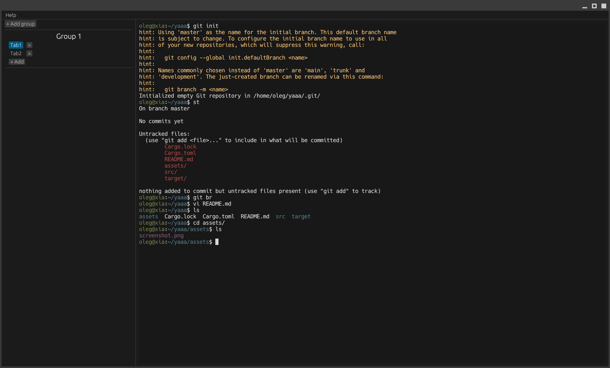

<p align="center">
  
</p>

# Yet Another AI Agent

Actually this is just fast and light terminal manager for another coding agents.



## Install

### macOS

The easiest way to install Yaaa on macOS is with the Ruby installer. It downloads the release binary, builds a local `.app` bundle and signs it ad-hoc, so Gatekeeper does not block it:

```bash
curl -fsSL https://raw.githubusercontent.com/OrelSokolov/yaaa/master/install.rb | ruby
```

Requires Ruby 2.6 or later (macOS ships with Ruby by default).

To install a specific version:

```bash
curl -fsSL https://raw.githubusercontent.com/OrelSokolov/yaaa/master/install.rb | YAAA_VERSION=v0.4.3 ruby
```

To install to a custom directory (default is `/Applications`):

```bash
curl -fsSL https://raw.githubusercontent.com/OrelSokolov/yaaa/master/install.rb | YAAA_INSTALL=~/Applications ruby
```
